```plantuml
@startuml
!theme materia
!pragma useVerticalIf on
skinparam note {
	BackgroundColor gray
	BorderColor lightgray
	FontColor white
}

TITLE Function: render_plantuml_diagram

START
PARTITION "[[https://aemocloud.sharepoint.com/:f:/s/WAFutureSystemDesign/EnTUHBvvbuVHgZ6S-wEr8EsB7sRDLLQJDwHcnT1Y9t1DWw?e=a4x9x7{go to DPV forecast sharepoint :)} call function]]" {
	:render_plantuml_diagram(file_path, diagram_format, theme, output_file_path);
	IF (default theme is supported?) THEN (yes)
		:use default theme;
	ELSE (no)
		#red: raise critical error;
	 	END
 	ENDIF
}
PARTITION resolve unset inputs {
	PARTITION resolve theme {
		IF (theme is not specified?) THEN (no)
			:set theme to default theme;
		(yes) ELSEIF (theme is supported?) THEN (no)
			#orange: log warning message;
			:use default theme;
		ELSE (yes)
			:use selected theme;
	 	ENDIF
	}
	PARTITION resolve output filepath {
		IF (output file path is specified?) THEN (no)
			:set output file path to
			current working directory;
		(yes) ELSEIF (output file path is a directory?) THEN (yes)
			:set file name to "output_diagram";
		ELSE (no)
	 	ENDIF
	}
}
PARTITION validate inputs {
	IF (input file exists?) THEN (no)
		#darkred: raise FileNotFoundError;
		END
	(yes) ELSEIF (output file path exists?) THEN (no)
		#darkred: raise FileNotFoundError;
		END
	(yes) ELSEIF (input file extension is supported?) THEN (no)
		#darkred: raise ValueError;
		END
	(yes) ELSEIF (diagram format is supported?) THEN (no)
		#darkred: raise ValueError;
		END
	ENDIF
}
PARTITION business logic {
	PARTITION get_required_plantuml_header_footer {
		:get required header and footer declarations; <<input>>
		#green:log debug message;
		NOTE LEFT
			required header and
			footer declarations
		END NOTE
		IF (plantuml markdown hint
is present in the file) THEN (yes)
			NOTE LEFT
				markdown hint:
			END NOTE
			:remove line containing
			plantuml markdown hint;
			NOTE LEFT
				this markdown hint will
				cause a rendering error
			END NOTE
			#green:log debug message;
			NOTE LEFT
				line containing plantuml
				markdown hint
			END NOTE
		ELSE (no)
		ENDIF
		IF (theme is already specified in file?) THEN (yes)
			:replace theme with specified theme; <<procedure>>
			#green:log debug message;
			NOTE LEFT
				location of already-existing
				theme in the file
			END NOTE
		ELSE (no)
		ENDIF
		:specify header and footer
		for plantUML diagram;
		:return header and footer; <<output>>
	}
	PARTITION render_plantuml_diagram {
		:create temporary copy of file; <<save>>
		#green:log debug message;
		NOTE LEFT:filepath of temporary file
		:get the required header and footer; <<input>>
		:append header and footer
		to temporary file; <<procedure>>
		:render plantUML diagram and
		save to output file path; <<procedure>>
		#green:log debug message;
		NOTE LEFT: output file path
		:delete temporary file;
		:return path of rendered diagram; <<output>>
	}
	:return path of rendered diagram file; <<output>>
}
STOP
@enduml
```

```plantuml
@startjson
{
  "data": {
    "caseFileVersion": 21.0,
    "dispatchInterval": "2021-01-01T08:00:00+08:00",
    "dispatchRunId": "WDE-834-CaseFile-001x",
    "dispatchType": "Dispatch",
    "intervalLength": 5,
    "primaryDispatchInterval": "2021-01-01T08:00:00+08:00",
    "runId": "WDE-834-CaseFile-001",
    "parameters": [
      {
        "name": "MarketPriceCap",
        "value": 1000.0
      },
      {
        "name": "MarketPriceFloor",
        "value": -1000.0
      },
      {
        "name": "MaxESSProvisionPercentageRegulationRaise",
        "value": 1.0
      },
      {
        "name": "MaxESSProvisionPercentageRegulationLower",
        "value": 1.0
      },
      {
        "name": "MaxESSProvisionPercentageContingencyRaise",
        "value": 1.0
      },
      {
        "name": "MaxESSProvisionPercentageContingencyLower",
        "value": 1.0
      },
      {
        "name": "MaxESSProvisionPercentageRocof",
        "value": 1.0
      }
    ],
    "constraintViolationParameters": [
      {
        "variable": "RampUpRateSurplus",
        "price": 1155.0
      },
      {
        "variable": "RampDownRateDeficit",
        "price": 1155.0
      },
      {
        "variable": "TrancheUBSurplus",
        "price": 1135.0
      },
      {
        "variable": "TrancheLBDeficit",
        "price": 1135.0
      },
      {
        "variable": "RegulationJointRampDownDeficit",
        "price": 155.0
      },
      {
        "variable": "RegulationJointRampUpSurplus",
        "price": 155.0
      },
      {
        "variable": "JointCapacityDeficit",
        "price": 155.0
      },
      {
        "variable": "JointCapacitySurplus",
        "price": 155.0
      },
      {
        "variable": "ERDeficit",
        "price": 155.0
      },
      {
        "variable": "ERSurplus",
        "price": 155.0
      },
      {
        "variable": "EnergyDeficit",
        "price": 150.0
      },
      {
        "variable": "EnergySurplus",
        "price": 150.0
      },
      {
        "variable": "EnablementMinDeficit",
        "price": 70.0
      },
      {
        "variable": "EnablementMaxSurplus",
        "price": 70.0
      },
      {
        "variable": "RCSDeficit",
        "price": 12.0
      },
      {
        "variable": "RegulationRaiseDeficit",
        "price": 10.0
      },
      {
        "variable": "RegulationLowerDeficit",
        "price": 10.0
      },
      {
        "variable": "ContingencyRaiseDeficit",
        "price": 8.0
      },
      {
        "variable": "ContingencyLowerDeficit",
        "price": 8.0
      },
      {
        "variable": "MaxESSProvisionPercentageSurplus",
        "price": 4.0
      },
      {
        "variable": "FSProfileDeficit",
        "price": 1130.0
      },
      {
        "variable": "FSProfileSurplus",
        "price": 1130.0
      },
      {
        "variable": "InflexibilityDeficit",
        "price": 1130.0
      },
      {
        "variable": "InflexibilitySurplus",
        "price": 1130.0
      },
      {
        "variable": "UIGFSurplus",
        "price": 12.0
      },
      {
        "variable": "UIGFDeficit",
        "price": 12.0
      },
      {
        "variable": "TieBreakingSlackPenalty",
        "price": 1e-06
      }
    ],
    "scada": {
      "scadaData": [
        {
          "tag": "SWIS_LOAD",
          "value": "400",
          "valueDataType": "number",
          "qualityFlag": "good",
          "dataSource": "scada",
          "asAtTimeStamp": "2022-04-20T12:27:27.0488214+08:00"
        },
        {
          "tag": "SWIS_LOAD_INERTIA",
          "value": "3000",
          "valueDataType": "number",
          "qualityFlag": "good",
          "dataSource": "scada",
          "asAtTimeStamp": "2022-04-20T12:27:27.0488214+08:00"
        },
        {
          "tag": "BGA_WF1.lowLimit",
          "value": "70",
          "valueDataType": "number",
          "qualityFlag": "good",
          "dataSource": "scada",
          "asAtTimeStamp": "2022-04-20T12:27:27.0488214+08:00"
        },
        {
          "tag": "BGA_WF1.highLimit",
          "value": "125",
          "valueDataType": "number",
          "qualityFlag": "good",
          "dataSource": "scada",
          "asAtTimeStamp": "2022-04-20T12:27:27.0488214+08:00"
        },
        {
          "tag": "BGA_WF1.maximumDownwardsRampRate",
          "value": "90",
          "valueDataType": "number",
          "qualityFlag": "good",
          "dataSource": "scada",
          "asAtTimeStamp": "2022-04-20T12:27:27.0488214+08:00"
        },
        {
          "tag": "BGA_WF1.maximumUpwardsRampRate",
          "value": "95",
          "valueDataType": "number",
          "qualityFlag": "good",
          "dataSource": "scada",
          "asAtTimeStamp": "2022-04-20T12:27:27.0488214+08:00"
        },
        {
          "tag": "BW_G1.lowLimit",
          "value": "33",
          "valueDataType": "number",
          "qualityFlag": "good",
          "dataSource": "scada",
          "asAtTimeStamp": "2022-04-20T12:27:27.0488214+08:00"
        },
        {
          "tag": "BW_G1.highLimit",
          "value": "199",
          "valueDataType": "number",
          "qualityFlag": "good",
          "dataSource": "scada",
          "asAtTimeStamp": "2022-04-20T12:27:27.0488214+08:00"
        },
        {
          "tag": "BW_G1.maximumDownwardsRampRate",
          "value": "33",
          "valueDataType": "number",
          "qualityFlag": "good",
          "dataSource": "scada",
          "asAtTimeStamp": "2022-04-20T12:27:27.0488214+08:00"
        },
        {
          "tag": "BW_G1.maximumUpwardsRampRate",
          "value": "123",
          "valueDataType": "number",
          "qualityFlag": "good",
          "dataSource": "scada",
          "asAtTimeStamp": "2022-04-20T12:27:27.0488214+08:00"
        },
        {
          "tag": "CPS_G1.lowLimit",
          "value": "30",
          "valueDataType": "number",
          "qualityFlag": "good",
          "dataSource": "scada",
          "asAtTimeStamp": "2022-04-20T12:27:27.0488214+08:00"
        },
        {
          "tag": "CPS_G1.highLimit",
          "value": "423",
          "valueDataType": "number",
          "qualityFlag": "good",
          "dataSource": "scada",
          "asAtTimeStamp": "2022-04-20T12:27:27.0488214+08:00"
        },
        {
          "tag": "CPS_G1.maximumDownwardsRampRate",
          "value": "278",
          "valueDataType": "number",
          "qualityFlag": "good",
          "dataSource": "scada",
          "asAtTimeStamp": "2022-04-20T12:27:27.0488214+08:00"
        },
        {
          "tag": "CPS_G1.maximumUpwardsRampRate",
          "value": "280",
          "valueDataType": "number",
          "qualityFlag": "good",
          "dataSource": "scada",
          "asAtTimeStamp": "2022-04-20T12:27:27.0488214+08:00"
        },
        {
          "tag": "BGA_WF1.energy.setPoint",
          "value": "120",
          "valueDataType": "number",
          "qualityFlag": "good",
          "dataSource": "scada",
          "asAtTimeStamp": "2022-04-20T12:27:27.0488214+08:00"
        },
        {
          "tag": "BW_G1.energy.setPoint",
          "value": "180",
          "valueDataType": "number",
          "qualityFlag": "good",
          "dataSource": "scada",
          "asAtTimeStamp": "2022-04-20T12:27:27.0488214+08:00"
        },
        {
          "tag": "CPS_G1.energy.setPoint",
          "value": "59",
          "valueDataType": "number",
          "qualityFlag": "good",
          "dataSource": "scada",
          "asAtTimeStamp": "2022-04-20T12:27:27.0488214+08:00"
        }
      ],
      "previousTarget": [],
      "dispatchCondition": [
        {
          "demand": "SWIS_LOAD",
          "loadInertia": "SWIS_LOAD_INERTIA"
        }
      ]
    },
    "constraints": {
      "constraintSet": [
        {
          "id": "constraint_0",
          "version": 0,
          "effectiveFrom": "2021-01-01T08:00:00+08:00",
          "effectiveTo": "2021-01-01T08:00:00+08:00"
        }
      ],
      "constraintEquations": [
        {
          "id": "constraint_0",
          "description": "constraint_0",
          "leftHandSide": [
            {
              "term": "GNN_GT11.energy",
              "coefficient": 1.0,
              "termType": "WEMDE",
              "index": 0
            },
            {
              "term": "CPS_G1.energy",
              "coefficient": 1.0,
              "termType": "WEMDE",
              "index": 0
            }
          ],
          "operator": "LessThanOrEqualTo",
          "rightHandSide": [],
          "rightHandSideScript": "",
          "required": false,
          "limitType": "Generic Constraint",
          "defaultRHS": 2000.0,
          "violationPenalty": 275.0,
          "version": 0,
          "effectiveFrom": "0001-01-01T00:00:00+00:00"
        }
      ]
    },
    "dfcmData": {
      "dfcmId": "1",
      "dfcmVersion": "1",
      "frequencyLimits": {
        "rocofMax": 1.0,
        "rocofMin": 1.0,
        "fmin": 1.0,
        "fmax": 1.0,
        "fss": 1.0
      },
      "tauValuesforCRPerformanceFactors": [
        0.2,
        0.5,
        1.0,
        2.0,
        3.0,
        4.0
      ],
      "dfcmValidationDetails": {
        "inertiaRangeMinimum": 3000.0,
        "inertiaRangeMaximum": 20000.0,
        "inertiaRangeStep": 250.0,
        "largestContingencySizeMinimum": 0.0,
        "largestContingencySizeMaximum": 500.0,
        "largestContingencySizeStep": 0.0
      }
    },
    "uigf": [
      {
        "facilityCode": "",
        "uigfmw": 0.0
      }
    ],
    "registrationData": [
      {
        "facilityCode": "BGA_WF1",
        "nol": false,
        "facilityStandingData": {
          "facilityRegistrationStatus": "REGISTERED",
          "facilityClass": "I",
          "storageConstraints": false,
          "inertia": 0.0,
          "tauFactor": 0.2,
          "effectiveDispatchIntervalFrom": "2021-01-01T08:00:00+08:00",
          "unconstrainedForecastSource": "scada"
        }
      },
      {
        "facilityCode": "BW_G1",
        "nol": false,
        "facilityStandingData": {
          "facilityRegistrationStatus": "REGISTERED",
          "facilityClass": "S",
          "storageConstraints": false,
          "inertia": 800.0,
          "tauFactor": 4.0,
          "effectiveDispatchIntervalFrom": "2021-01-01T08:00:00+08:00",
          "unconstrainedForecastSource": "scada"
        }
      },
      {
        "facilityCode": "CPS_G1",
        "nol": false,
        "facilityStandingData": {
          "facilityRegistrationStatus": "REGISTERED",
          "facilityClass": "S",
          "storageConstraints": false,
          "inertia": 1200.0,
          "tauFactor": 4.0,
          "effectiveDispatchIntervalFrom": "2021-01-01T08:00:00+08:00",
          "unconstrainedForecastSource": "scada"
        }
      }
    ],
    "facilityLossFactors": [
      {
        "facilityCode": "zzzz",
        "distributionLossFactor": 1.0,
        "transmissionLossFactor": 1.0
      },
      {
        "facilityCode": "ALINTA_WWF",
        "distributionLossFactor": 1.0,
        "transmissionLossFactor": 1.0
      },
      {
        "facilityCode": "BADGINGARRA_WF1",
        "distributionLossFactor": 1.0,
        "transmissionLossFactor": 1.0
      },
      {
        "facilityCode": "BW1_BLUEWATERS_G2",
        "distributionLossFactor": 1.0,
        "transmissionLossFactor": 1.0
      },
      {
        "facilityCode": "BW2_BLUEWATERS_G1",
        "distributionLossFactor": 1.0,
        "transmissionLossFactor": 1.0
      },
      {
        "facilityCode": "COCKBURN_CCG1",
        "distributionLossFactor": 1.0,
        "transmissionLossFactor": 1.0
      },
      {
        "facilityCode": "COLLIE_G1",
        "distributionLossFactor": 1.0,
        "transmissionLossFactor": 1.0
      },
      {
        "facilityCode": "EDWFMAN_WF1",
        "distributionLossFactor": 1.0,
        "transmissionLossFactor": 1.0
      },
      {
        "facilityCode": "GRASMERE_WF1",
        "distributionLossFactor": 1.0,
        "transmissionLossFactor": 1.0
      },
      {
        "facilityCode": "GREENOUGH_RIVER_PV1",
        "distributionLossFactor": 1.0,
        "transmissionLossFactor": 1.0
      },
      {
        "facilityCode": "INVESTEC_COLLGAR_WF1",
        "distributionLossFactor": 1.0,
        "transmissionLossFactor": 1.0
      },
      {
        "facilityCode": "KEMERTON_GT11",
        "distributionLossFactor": 1.0,
        "transmissionLossFactor": 1.0
      },
      {
        "facilityCode": "KEMERTON_GT12",
        "distributionLossFactor": 1.0,
        "transmissionLossFactor": 1.0
      },
      {
        "facilityCode": "KWINANA_GT2",
        "distributionLossFactor": 1.0,
        "transmissionLossFactor": 1.0
      },
      {
        "facilityCode": "KWINANA_GT3",
        "distributionLossFactor": 1.0,
        "transmissionLossFactor": 1.0
      },
      {
        "facilityCode": "MGA_SYNC01",
        "distributionLossFactor": 1.0,
        "transmissionLossFactor": 1.0
      },
      {
        "facilityCode": "MRS_SF1",
        "distributionLossFactor": 1.0,
        "transmissionLossFactor": 1.0
      },
      {
        "facilityCode": "MUJA_B1",
        "distributionLossFactor": 1.0,
        "transmissionLossFactor": 1.0
      },
      {
        "facilityCode": "MUJA_G5",
        "distributionLossFactor": 1.0,
        "transmissionLossFactor": 1.0
      },
      {
        "facilityCode": "MUJA_G6",
        "distributionLossFactor": 1.0,
        "transmissionLossFactor": 1.0
      },
      {
        "facilityCode": "MUJA_G7",
        "distributionLossFactor": 1.0,
        "transmissionLossFactor": 1.0
      },
      {
        "facilityCode": "MUJA_G8",
        "distributionLossFactor": 1.0,
        "transmissionLossFactor": 1.0
      },
      {
        "facilityCode": "MWF_MUMBIDA_WF1",
        "distributionLossFactor": 1.0,
        "transmissionLossFactor": 1.0
      },
      {
        "facilityCode": "NAMKKN_MERR_SG1",
        "distributionLossFactor": 1.0,
        "transmissionLossFactor": 1.0
      },
      {
        "facilityCode": "NEWGEN_KWINANA_CCG1",
        "distributionLossFactor": 1.0,
        "transmissionLossFactor": 1.0
      },
      {
        "facilityCode": "NEWGEN_NEERABUP_GT1",
        "distributionLossFactor": 1.0,
        "transmissionLossFactor": 1.0
      },
      {
        "facilityCode": "PERTHENERGY_KWINANA_GT1",
        "distributionLossFactor": 1.0,
        "transmissionLossFactor": 1.0
      },
      {
        "facilityCode": "PINJAR_GT1",
        "distributionLossFactor": 1.0,
        "transmissionLossFactor": 1.0
      },
      {
        "facilityCode": "PINJAR_GT10",
        "distributionLossFactor": 1.0,
        "transmissionLossFactor": 1.0
      },
      {
        "facilityCode": "PINJAR_GT11",
        "distributionLossFactor": 1.0,
        "transmissionLossFactor": 1.0
      },
      {
        "facilityCode": "PINJAR_GT2",
        "distributionLossFactor": 1.0,
        "transmissionLossFactor": 1.0
      },
      {
        "facilityCode": "PINJAR_GT3",
        "distributionLossFactor": 1.0,
        "transmissionLossFactor": 1.0
      },
      {
        "facilityCode": "PINJAR_GT4",
        "distributionLossFactor": 1.0,
        "transmissionLossFactor": 1.0
      },
      {
        "facilityCode": "PINJAR_GT5",
        "distributionLossFactor": 1.0,
        "transmissionLossFactor": 1.0
      },
      {
        "facilityCode": "PINJAR_GT7",
        "distributionLossFactor": 1.0,
        "transmissionLossFactor": 1.0
      },
      {
        "facilityCode": "PINJAR_GT9",
        "distributionLossFactor": 1.0,
        "transmissionLossFactor": 1.0
      },
      {
        "facilityCode": "PPP_KCP_EG1",
        "distributionLossFactor": 1.0,
        "transmissionLossFactor": 1.0
      },
      {
        "facilityCode": "PRK_AG",
        "distributionLossFactor": 1.0,
        "transmissionLossFactor": 1.0
      },
      {
        "facilityCode": "STHRNCRS_EG",
        "distributionLossFactor": 1.0,
        "transmissionLossFactor": 1.0
      },
      {
        "facilityCode": "TIWEST_COG1",
        "distributionLossFactor": 1.0,
        "transmissionLossFactor": 1.0
      },
      {
        "facilityCode": "WDW_WF1",
        "distributionLossFactor": 1.0,
        "transmissionLossFactor": 1.0
      },
      {
        "facilityCode": "YAN_WF1",
        "distributionLossFactor": 1.0,
        "transmissionLossFactor": 1.0
      },
      {
        "facilityCode": "BGA_WF1",
        "distributionLossFactor": 1.0,
        "transmissionLossFactor": 1.0
      },
      {
        "facilityCode": "BW_G1",
        "distributionLossFactor": 1.0,
        "transmissionLossFactor": 1.0
      },
      {
        "facilityCode": "CPS_G1",
        "distributionLossFactor": 1.0,
        "transmissionLossFactor": 1.0
      }
    ],
    "markets": {
      "energy": {
        "marketService": "energy",
        "baseForecastRequirement": 400.0,
        "overrideForecastRequirement": 0.0,
        "baseForecastRequirementHigh": 400.0,
        "baseForecastRequirementLow": 400.0,
        "facilities": [
          {
            "maxInjectionCapacity": 130.0,
            "maxWithdrawalCapacity": 0.0,
            "withdrawalQuantity": 0.0,
            "inflexibleFlag": false,
            "maxUpwardRampRate": 300.0,
            "maxDownwardRampRate": 300.0,
            "fsip": {
              "t1": 0.0,
              "t2": 0.0,
              "t3": 0.0,
              "t4": 0.0,
              "minimumLoad": 0.0
            },
            "facilityCode": "BGA_WF1",
            "submissionId": "Latest Submission ID",
            "tranches": [
              {
                "tranche": 1,
                "fuelType": "LIQUID",
                "quantity": 119.0,
                "submittedPrice": 40.0,
                "lfaPrice": 40.0,
                "capacityType": "IN-SERVICE"
              }
            ],
            "submissionCode": "market"
          },
          {
            "maxInjectionCapacity": 220.0,
            "maxWithdrawalCapacity": 0.0,
            "withdrawalQuantity": 0.0,
            "inflexibleFlag": false,
            "maxUpwardRampRate": 300.0,
            "maxDownwardRampRate": 300.0,
            "fsip": {
              "t1": 0.0,
              "t2": 0.0,
              "t3": 0.0,
              "t4": 0.0,
              "minimumLoad": 0.0
            },
            "facilityCode": "BW_G1",
            "submissionId": "Latest Submission ID",
            "tranches": [
              {
                "tranche": 1,
                "fuelType": "LIQUID",
                "quantity": 270.0,
                "submittedPrice": -235.0,
                "lfaPrice": -235.0,
                "capacityType": "IN-SERVICE"
              },
              {
                "tranche": 2,
                "fuelType": "LIQUID",
                "quantity": 260.0,
                "submittedPrice": -60.0,
                "lfaPrice": -60.0,
                "capacityType": "IN-SERVICE"
              },
              {
                "tranche": 3,
                "fuelType": "LIQUID",
                "quantity": 270.0,
                "submittedPrice": 25.0,
                "lfaPrice": 25.0,
                "capacityType": "IN-SERVICE"
              },
              {
                "tranche": 4,
                "fuelType": "LIQUID",
                "quantity": 220.0,
                "submittedPrice": 150.0,
                "lfaPrice": 150.0,
                "capacityType": "IN-SERVICE"
              }
            ],
            "submissionCode": "market"
          },
          {
            "maxInjectionCapacity": 340.0,
            "maxWithdrawalCapacity": 0.0,
            "withdrawalQuantity": 0.0,
            "inflexibleFlag": false,
            "maxUpwardRampRate": 300.0,
            "maxDownwardRampRate": 300.0,
            "fsip": {
              "t1": 0.0,
              "t2": 0.0,
              "t3": 0.0,
              "t4": 0.0,
              "minimumLoad": 0.0
            },
            "facilityCode": "CPS_G1",
            "submissionId": "Latest Submission ID",
            "tranches": [
              {
                "tranche": 1,
                "fuelType": "LIQUID",
                "quantity": 160.0,
                "submittedPrice": -10.0,
                "lfaPrice": -10.0,
                "capacityType": "IN-SERVICE"
              },
              {
                "tranche": 2,
                "fuelType": "LIQUID",
                "quantity": 180.0,
                "submittedPrice": 20.0,
                "lfaPrice": 20.0,
                "capacityType": "IN-SERVICE"
              }
            ],
            "submissionCode": "market"
          }
        ]
      },
      "regulationRaise": {
        "marketService": "regulationRaise",
        "baseForecastRequirement": 0.0,
        "overrideForecastRequirement": 0.0,
        "facilities": [
          {
            "enablementMinimum": 0.0,
            "lowBreakpoint": 200.0,
            "highBreakpoint": 300.0,
            "enablementMaximum": 300.0,
            "maximumCapacity": 300.0,
            "facilityCode": "CPS_G1",
            "submissionId": "Latest Submission ID",
            "tranches": [
              {
                "tranche": 1,
                "fuelType": "LIQUID",
                "quantity": 10.0,
                "submittedPrice": 0.0,
                "lfaPrice": 0.0,
                "capacityType": "IN-SERVICE"
              }
            ],
            "submissionCode": "market"
          },
          {
            "enablementMinimum": 0.0,
            "lowBreakpoint": 200.0,
            "highBreakpoint": 300.0,
            "enablementMaximum": 300.0,
            "maximumCapacity": 300.0,
            "facilityCode": "BGA_WF1",
            "submissionId": "Latest Submission ID",
            "tranches": [
              {
                "tranche": 1,
                "fuelType": "LIQUID",
                "quantity": 10.0,
                "submittedPrice": 10.0,
                "lfaPrice": 10.0,
                "capacityType": "IN-SERVICE"
              }
            ],
            "submissionCode": "market"
          },
          {
            "enablementMinimum": 0.0,
            "lowBreakpoint": 200.0,
            "highBreakpoint": 300.0,
            "enablementMaximum": 300.0,
            "maximumCapacity": 300.0,
            "facilityCode": "BW_G1",
            "submissionId": "Latest Submission ID",
            "tranches": [
              {
                "tranche": 1,
                "fuelType": "LIQUID",
                "quantity": 10.0,
                "submittedPrice": 0.0,
                "lfaPrice": 0.0,
                "capacityType": "IN-SERVICE"
              }
            ],
            "submissionCode": "market"
          }		  
        ]
      },
      "regulationLower": {
        "marketService": "regulationLower",
        "baseForecastRequirement": 0.0,
        "overrideForecastRequirement": 0.0,
        "facilities": [
          {
            "enablementMinimum": 120.0,
            "lowBreakpoint": 150.0,
            "highBreakpoint": 300.0,
            "enablementMaximum": 300.0,
            "maximumCapacity": 300.0,
            "facilityCode": "BGA_WF1",
            "submissionId": "Latest Submission ID",
            "tranches": [
              {
                "tranche": 1,
                "fuelType": "LIQUID",
                "quantity": 20.0,
                "submittedPrice": 20.0,
                "lfaPrice": 20.0,
                "capacityType": "IN-SERVICE"
              }
            ],
            "submissionCode": "market"
          },
		  {
            "enablementMinimum": 70.0,
            "lowBreakpoint": 150.0,
            "highBreakpoint": 300.0,
            "enablementMaximum": 300.0,
            "maximumCapacity": 300.0,
            "facilityCode": "BW_G1",
            "submissionId": "Latest Submission ID",
            "tranches": [
              {
                "tranche": 1,
                "fuelType": "LIQUID",
                "quantity": 20.0,
                "submittedPrice": 20.0,
                "lfaPrice": 20.0,
                "capacityType": "IN-SERVICE"
              }
            ],
            "submissionCode": "market"
          },
		  {
            "enablementMinimum": 160.0,
            "lowBreakpoint": 150.0,
            "highBreakpoint": 300.0,
            "enablementMaximum": 300.0,
            "maximumCapacity": 300.0,
            "facilityCode": "CPS_G1",
            "submissionId": "Latest Submission ID",
            "tranches": [
              {
                "tranche": 1,
                "fuelType": "LIQUID",
                "quantity": 20.0,
                "submittedPrice": 20.0,
                "lfaPrice": 20.0,
                "capacityType": "IN-SERVICE"
              }
            ],
            "submissionCode": "market"
          }
        ]
      },
      "contingencyRaise": {
        "marketService": "contingencyRaise",
        "baseForecastRequirement": 0.0,
        "overrideForecastRequirement": 0.0,
        "facilities": [
          {
            "enablementMinimum": 0.0,
            "lowBreakpoint": 0.0,
            "highBreakpoint": 250.0,
            "enablementMaximum": 250.0,
            "maximumCapacity": 250.0,
            "facilityCode": "BGA_WF1",
            "submissionId": "Latest Submission ID",
            "tranches": [
              {
                "tranche": 1,
                "fuelType": "LIQUID",
                "quantity": 200.0,
                "submittedPrice": 30.0,
                "lfaPrice": 30.0,
                "capacityType": "IN-SERVICE"
              }
            ],
            "submissionCode": "market"
          },
          {
            "enablementMinimum": 70.0,
            "lowBreakpoint": 70.0,
            "highBreakpoint": 200.0,
            "enablementMaximum": 220.0,
            "maximumCapacity": 220.0,
            "facilityCode": "BW_G1",
            "submissionId": "Latest Submission ID",
            "tranches": [
              {
                "tranche": 1,
                "fuelType": "LIQUID",
                "quantity": 200.0,
                "submittedPrice": 5.5,
                "lfaPrice": 5.5,
                "capacityType": "IN-SERVICE"
              }
            ],
            "submissionCode": "market"
          }
        ]
      },
      "contingencyLower": {
        "marketService": "contingencyLower",
        "baseForecastRequirement": 30.0,
        "overrideForecastRequirement": 0.0,
        "facilities": [
          {
            "enablementMinimum": 0.0,
            "lowBreakpoint": 20.0,
            "highBreakpoint": 200.0,
            "enablementMaximum": 200.0,
            "maximumCapacity": 200.0,
            "facilityCode": "BGA_WF1",
            "submissionId": "Latest Submission ID",
            "tranches": [
              {
                "tranche": 1,
                "fuelType": "LIQUID",
                "quantity": 4.0,
                "submittedPrice": 10.0,
                "lfaPrice": 10.0,
                "capacityType": "IN-SERVICE"
              },
              {
                "tranche": 2,
                "fuelType": "LIQUID",
                "quantity": 4.0,
                "submittedPrice": 3.3,
                "lfaPrice": 3.3,
                "capacityType": "IN-SERVICE"
              },
              {
                "tranche": 3,
                "fuelType": "LIQUID",
                "quantity": 4.0,
                "submittedPrice": 5.3,
                "lfaPrice": 5.3,
                "capacityType": "IN-SERVICE"
              },
              {
                "tranche": 4,
                "fuelType": "LIQUID",
                "quantity": 8.0,
                "submittedPrice": 21.3,
                "lfaPrice": 21.3,
                "capacityType": "IN-SERVICE"
              }
            ],
            "submissionCode": "market"
          },
          {
            "enablementMinimum": 30.0,
            "lowBreakpoint": 50.0,
            "highBreakpoint": 220.0,
            "enablementMaximum": 300.0,
            "maximumCapacity": 220.0,
            "facilityCode": "BW_G1",
            "submissionId": "Latest Submission ID",
            "tranches": [
              {
                "tranche": 1,
                "fuelType": "LIQUID",
                "quantity": 4.0,
                "submittedPrice": 10.0,
                "lfaPrice": 10.0,
                "capacityType": "IN-SERVICE"
              },
              {
                "tranche": 2,
                "fuelType": "LIQUID",
                "quantity": 4.0,
                "submittedPrice": 31.4,
                "lfaPrice": 31.4,
                "capacityType": "IN-SERVICE"
              },
              {
                "tranche": 3,
                "fuelType": "LIQUID",
                "quantity": 4.0,
                "submittedPrice": 41.4,
                "lfaPrice": 41.4,
                "capacityType": "IN-SERVICE"
              },
              {
                "tranche": 4,
                "fuelType": "LIQUID",
                "quantity": 4.0,
                "submittedPrice": 51.4,
                "lfaPrice": 51.4,
                "capacityType": "IN-SERVICE"
              },
              {
                "tranche": 5,
                "fuelType": "LIQUID",
                "quantity": 4.0,
                "submittedPrice": 61.4,
                "lfaPrice": 61.4,
                "capacityType": "IN-SERVICE"
              }
            ],
            "submissionCode": "market"
          },
          {
            "enablementMinimum": 0.0,
            "lowBreakpoint": 200.0,
            "highBreakpoint": 300.0,
            "enablementMaximum": 300.0,
            "maximumCapacity": 300.0,
            "facilityCode": "CPS_G1",
            "submissionId": "Latest Submission ID",
            "tranches": [
              {
                "tranche": 1,
                "fuelType": "LIQUID",
                "quantity": 10.0,
                "submittedPrice": 10.0,
                "lfaPrice": 10.0,
                "capacityType": "IN-SERVICE"
              }
            ],
            "submissionCode": "market"
          }
        ]
      },
      "rocof": {
        "marketService": "rocof",
        "baseForecastRequirement": 0.0,
        "overrideForecastRequirement": 0.0,
        "facilities": [
          {
            "enablementMinimum": 0.0,
            "lowBreakpoint": 0.0,
            "highBreakpoint": 130.0,
            "enablementMaximum": 130.0,
            "maximumCapacity": 130.0,
            "facilityCode": "BGA_WF1",
            "submissionId": "Latest Submission ID",
            "tranches": [
              {
                "tranche": 1,
                "fuelType": "LIQUID",
                "quantity": 3000.0,
                "submittedPrice": 2.0,
                "lfaPrice": 2.0,
                "capacityType": "IN-SERVICE"
              }
            ],
            "submissionCode": "market"
          },
          {
            "enablementMinimum": 70.0,
            "lowBreakpoint": 70.0,
            "highBreakpoint": 220.0,
            "enablementMaximum": 220.0,
            "maximumCapacity": 220.0,
            "facilityCode": "BW_G1",
            "submissionId": "Latest Submission ID",
            "tranches": [
              {
                "tranche": 1,
                "fuelType": "LIQUID",
                "quantity": 800.0,
                "submittedPrice": 0.2,
                "lfaPrice": 0.2,
                "capacityType": "IN-SERVICE"
              }
            ],
            "submissionCode": "market"
          },
          {
            "enablementMinimum": 160.0,
            "lowBreakpoint": 160.0,
            "highBreakpoint": 340.0,
            "enablementMaximum": 340.0,
            "maximumCapacity": 340.0,
            "facilityCode": "CPS_G1",
            "submissionId": "Latest Submission ID",
            "tranches": [
              {
                "tranche": 1,
                "fuelType": "LIQUID",
                "quantity": 1200.0,
                "submittedPrice": 1.0,
                "lfaPrice": 1.0,
                "capacityType": "IN-SERVICE"
              }
            ],
            "submissionCode": "market"
          }
        ]
      },
      "dsp": {
        "requirement": 0.0,
        "facilities": []
      }
    },
    "rcmData": [],
    "marketServicesPriceFlag": {
      "energyPriceAtCap": false,
      "regulationRaisePriceAtCap": false,
      "regulationLowerPriceAtCap": false,
      "contingencyLowerPriceAtCap": false,
      "contingencyRaisePriceAtCap": false,
      "rocofPriceAtCap": false
    }
  }
}
@endjson
```